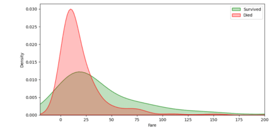
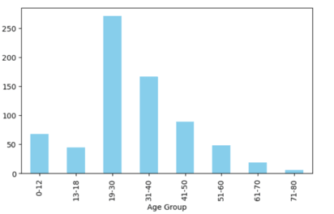
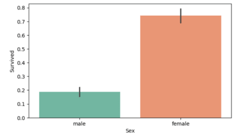

# Titanic Survival Prediction: Project Overview

* Developed a logistic regression model to predict passenger survival on the Titanic using binary classification.
* Preprocessed the Titanic dataset by filling missing values, encoding categorical variables, and scaling features.
* Conducted exploratory data analysis (EDA) to examine distributions and correlations between variables.
* Built and evaluated the logistic regression model, achieving an accuracy score of 0.7598.

## Code and Resources Used 
**Python Version:** 3.7  
**Packages:** pandas, numpy, seaborn, matplotlib, sklearn  
**Kaggle Dataset:** [Titanic Dataset]([https://www.kaggle.com/c/titanic/data](https://www.kaggle.com/datasets/yasserh/titanic-dataset))

## Data Preprocessing and Feature Engineering
The data required cleaning and processing before modeling. Here’s what I did:
* Filled missing values in the 'Age' column with the median and replaced missing values in 'Embarked' with 'S'.
* Dropped the 'Cabin' column due to excessive missing data.
* Created new features such as 'Age Group' by binning ages and 'TravelAlone' to identify solo passengers.
* Used one-hot encoding for categorical variables like 'Sex' and 'Pclass'.
* Scaled numerical features like 'Age' and 'Fare' using MinMaxScaler.

## EDA
I visualized key variables to better understand the data:
* Binned passengers by 'Age Group' to compare survival rates across different age ranges.
* Used count plots to visualize embarkation locations and bar plots to show survival rates by gender and passenger class.
* Identified that females and passengers in higher classes had higher survival rates.

## Model Building
I split the data into training and test sets (80/20 split) and used logistic regression for classification. I chose this model for its interpretability in binary classification tasks.

## Model Performance
The logistic regression model was evaluated on the test set, resulting in an accuracy score of 0.7598.

**Classification Report:**

|               | Precision | Recall | F1-Score | Support |
|---------------|-----------|--------|----------|---------|
| 0             | 0.74      | 0.87   | 0.80     | 100     |
| 1             | 0.79      | 0.62   | 0.70     | 79      |
| **Accuracy**  |           |        | 0.76     | 179     |
| **Macro Avg** | 0.77      | 0.75   | 0.75     | 179     |
| **Weighted Avg** | 0.76   | 0.76   | 0.75     | 179     |
